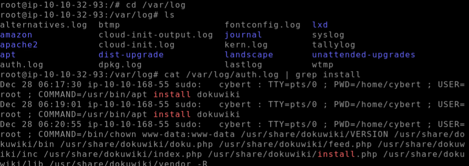

# FORENSICS CHALLENGE
## TRYHACKME CTF ROOM
*https://tryhackme.com/r/room/disgruntled*

### Description
Hey, kid! Good, you’re here!

Not sure if you’ve seen the news, but an employee from the IT department of one of our clients (CyberT) got arrested by the police. The guy was running a successful phishing operation as a side gig.

CyberT wants us to check if this person has done anything malicious to any of their assets. Get set up, grab a cup of coffee, and meet me in the conference room.

- Connect to the VM 

### Walkthrough

Lets have a poke around at the privileged commands that were run.
- cd var/log
- ls

Read the file and filter the search
- cat /var/log/auth.log | grep install

#### Flag 1 : /usr/bin/apt install dokuwiki
#### Flag 2 : /home/cybert
